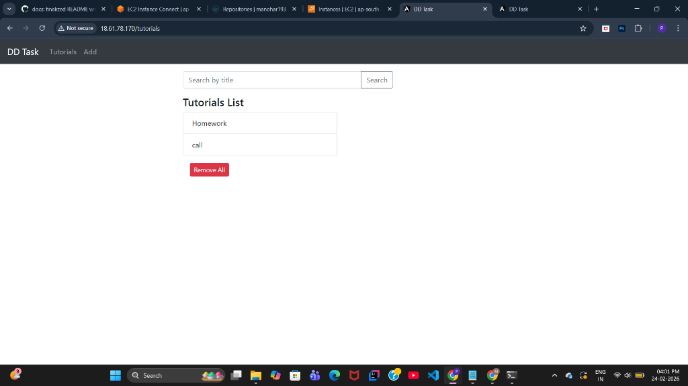
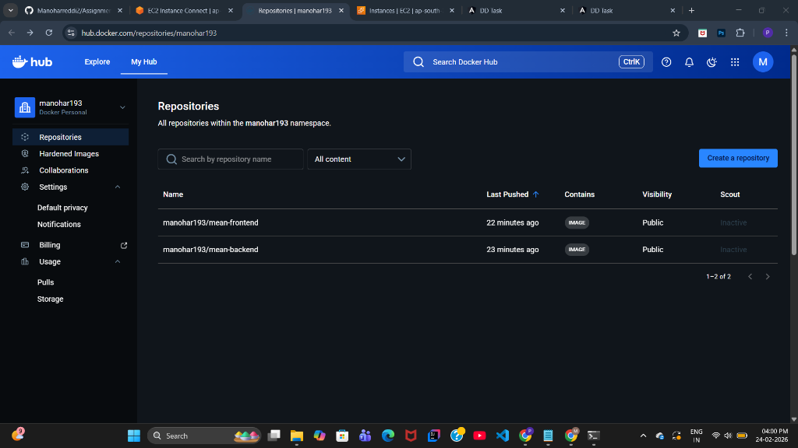
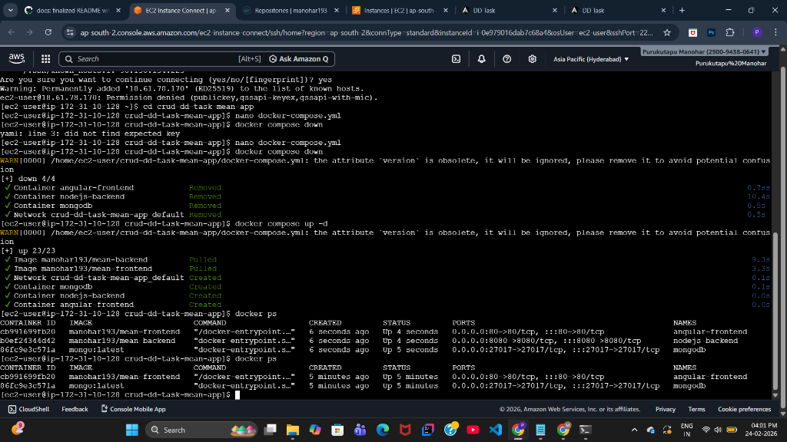
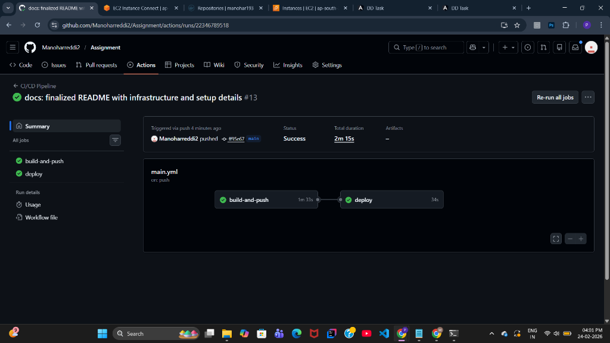

# MEAN Stack CRUD Application - DevOps Containerization & Deployment

This project demonstrates the containerization and automated deployment of a full-stack MEAN (MongoDB, Express, Angular, Node.js) application using Docker, GitHub Actions, and Nginx.



## 🚀 Application Details
*   **Application Access URL**: [http://18.61.78.170](http://18.61.78.170)
*   **DockerHub Repositories**:
    *   `manohar193/mean-frontend`
    *   `manohar193/mean-backend`



## ☁️ Infrastructure Overview
*   **Cloud Platform**: AWS EC2
*   **Operating System**: Amazon Linux 2023
*   **Instance Type**: t3.micro
*   **Web Server**: Nginx (Reverse Proxy)
*   **Database**: MongoDB (Official Docker Image)

---

## 🛠️ Project Setup & Configuration

### 🔹 1. Project Setup Steps
The application consists of a Node.js backend (`/backend`) and an Angular frontend (`/frontend`).
1.  **Backend**: Express.js server providing REST APIs for managing tutorials.
2.  **Frontend**: Angular application using `HttpClient` for API communication.
3.  **Database**: MongoDB stores tutorial data (Title, Description, Published status).

### 🔹 2. Docker Build Steps
Each component has its own `Dockerfile`:
*   **Backend Dockerfile**: Uses `node:18-alpine` to build and serve the Express app.
*   **Frontend Dockerfile**: Multi-stage build (Node.js for building, Nginx for serving the production files).
*   **Build Command**:
    ```bash
    docker compose build
    ```

### 🔹 3. DockerHub Push Steps
The build process is automated via GitHub Actions:
1.  Images are tagged as `latest`.
2.  Authenticated via DockerHub Access Tokens.
3.  Pushed to `manohar193/mean-backend` and `manohar193/mean-frontend`.

### 🔹 4. EC2 Deployment Steps
The application is deployed using `docker-compose.yml` on the EC2 instance:
1.  The `docker-compose.yml` defines three services: `frontend`, `backend`, and `mongodb`.
2.  **Network**: All services communicate over a bridge network.
3.  **Command to Deploy**:
    ```bash
    docker compose pull
    docker compose up -d
    ```



### 🔹 5. GitHub Actions CI/CD Steps
The `.github/workflows/main.yml` automates the entire flow:
1.  **Build & Push**: Builds Docker images and pushes to DockerHub on every push to `main`.
2.  **SCP Transfer**: Automatically copies the `docker-compose.yml` and `nginx/nginx.conf` to the EC2 instance.
3.  **SSH Deploy**: Connects to the EC2 instance via SSH, pulls the latest images, and restarts the containers.



### 🔹 6. Nginx Setup
Nginx acts as the entry point for the application on **Port 80**:
*   Serves the Angular static files.
*   Proxies all `/api` requests to the Node.js backend.
*   Handles Single Page Application (SPA) routing to prevent 404 errors on browser refresh.

### 🔹 7. MongoDB Setup
*   **Deployment**: Official MongoDB Docker image is integrated within the `docker-compose.yml`.
*   **Persistence**: Data is kept consistent within the container-based setup.
*   **Connectivity**: The backend connects to `mongodb:27017` using environment variables.

---

## ✅ Deployment Checklist & Verification
- [x] **Angular UI**: Accessible at Port 80.
- [x] **REST API**: Forwarded via Nginx to the backend service.
- [x] **Auto Deployment**: Triggered by GitHub Actions on code changes.
- [x] **Infrastructure**: AWS EC2 instance running Amazon Linux 2023.

---
*Created as part of the Technical Assignment for Discover Dollar Inc.*